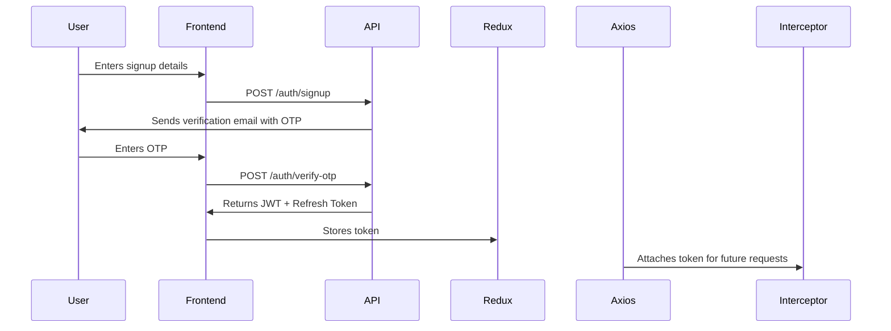

# 🛒 RetailX — E-Commerce Frontend (React + Redux Toolkit)


## 🎯 Overview

**RetailX** is a production-ready **React + Redux Toolkit** e-commerce frontend that connects to a Node.js + MongoDB backend.
It includes complete **user, admin, and analytics functionality**, secure authentication, **Razorpay payment integration**, and **email-based signup verification**.

---
# for access

# USER
 * E-MAIL:chandru666@gmail.com
 * PASSWORD:Chandru124 
# ADMIN  
 * E-MAIL: admin666@gmail.com
 * PASSWORD :Admin123

 FOR SAFTEY REASON CERTAIN ACTIONS FOR ADMIN ARE RESTRICTED

## ✨ Features

### 🧑‍💻 User Features

* 🔐 **Authentication**

  * Signup with email verification (OTP)
  * Login with JWT + refresh token
  * Forgot/Reset password flow

* 🛍️ **Product Management**

  * View all products with pagination
  * Filter by category, brand, price, and tags
  * Full-text search using MongoDB text indexes
  * Sort by name, price, or popularity

* 🛒 **Cart & Checkout**

  * Add, update, or remove products
  * Auto-calculated totals and quantity sync
  * Persistent cart with Redux Toolkit
  * **Secure Razorpay payment integration** for orders

* 💳 **Orders**

  * Place orders after successful payment
  * View order history with status updates
  * Real-time payment confirmation via Razorpay

---

### 👨‍💼 Admin Features

* 🧭 **Dashboard Overview**

  * Displays analytics data from backend aggregation:

     * Total active products
     * top 3 selling products
     * Total revenue from completed orders
     * Orders awaiting processing
     * Registered user count

* 📦 **Product Management**

  * Create, edit, delete products
  * Manage stock, price, category, and tags

* 🧾 **Order Management**

  * Track order status and payment confirmation
  * Update shipping status

* 👥 **User Management**

  * View all users
  * Role-based access control (Admin/User)

---

## 🛠️ Tech Stack

| Technology                 | Purpose                        |
| -------------------------- | ------------------------------ |
| **React 19**               | Frontend library               |
| **Redux Toolkit**          | State management               |
| **React Router DOM**       | Routing                        |
| **Axios**                  | API handling with interceptors |
| **Tailwind CSS + DaisyUI** | Styling and UI                 |
| **Lucide React**           | Icons                          |
| **Vite**                   | Development and build tool     |

---

## 📁 Project Structure

```
src/
├── api/              # Axios instances & services
├── assets/           # Images and static files
├── components/       # Reusable UI components
├── layout/           # Layout wrappers for user/admin
├── pages/            # Route-based pages
├── store/            # Redux slices and configuration
├── utils/            # Token services, config, helpers
├── App.jsx           # Route setup
└── main.jsx          # App entry point
```

---

## ⚙️ Setup Instructions

```bash
# 1️⃣ Clone repo
git clone https://github.com/Chandar-uoo/E-COMMERCE-FE.git
cd E-COMMERCE-FE

# 2️⃣ Create .env file
VITE_API_URL="http://localhost:3000/api"

# 3️⃣ Install dependencies
npm install

# 4️⃣ Run development server
npm run dev
```

---

## 🧩 Architecture Overview

**Frontend Flow**

```
Component → Redux Slice → Axios Service → REST API → MongoDB Backend
```

* Centralized API layer for maintainability
* Interceptors auto-attach JWT and refresh tokens
* Redux Toolkit handles caching and global state
* Token refresh handled automatically on 401 responses


## 🔐 Authentication Flow



✅ Includes **email OTP verification** during signup
✅ JWT tokens + auto-refresh for secure sessions
✅ Tokens handled in memory (no localStorage leaks)

---


## ⚡ Performance

* 🚀 **Vite** for ultra-fast dev server & optimized builds
* 🧠 **RTK Query caching** to prevent redundant requests
* 🔄 **Axios interceptors** for clean API handling

---

## 🧾 Version

| Version              | Status   | Highlights                                             |
| -------------------- | -------- | ------------------------------------------------------ |
| **v1.3.0**           | ✅ Stable | Razorpay + Email Signup Verification + Admin Analytics |


---

## 👤 Author

**Chandru V**
💻 GitHub: [@Chandar-uoo](https://github.com/Chandar-uoo)
📧 Email: [chandruofficial666@gmail.com](mailto:chandruofficial666@gmail.com)
💼 Portfolio: Coming Soon

---


⭐ *Star this repo if you found it helpful!*
Made with ❤️ by **Chandru V**

